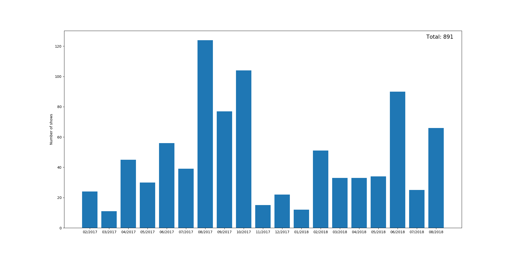
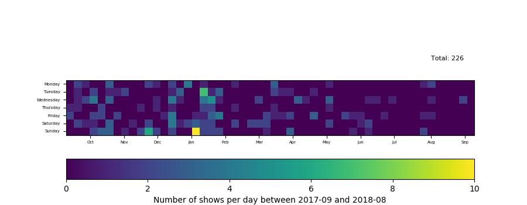

# netflix-data-analysis

Python script to visualize a netflix's account viewing activity data over a year in two different ways: a bar diagram or a heatmap.

## Getting Started

In order to use the script you will need to download your viewing activity data from https://www.netflix.com/viewingactivity. \
Then you need to create a Python test file where you will import NDA.py. In this file you can use either the function bar_diagram
or heatmap giving the path of the data file and the output file.
